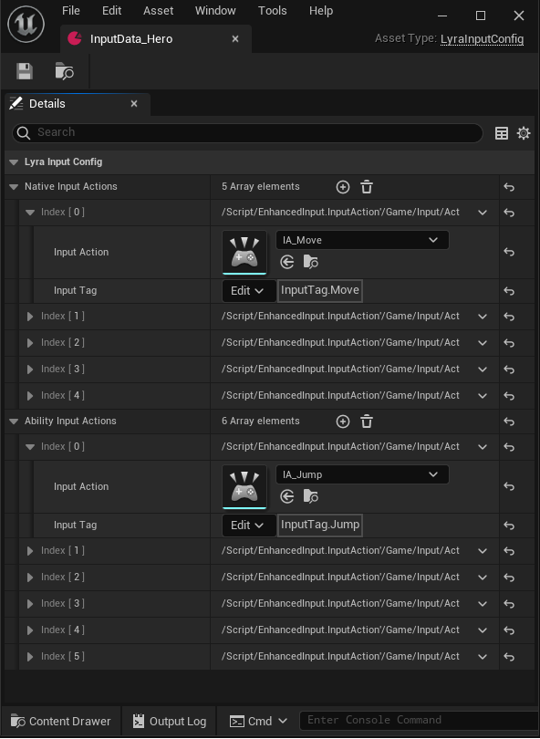
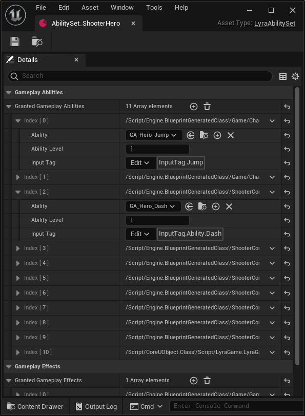

# Lyra Input Config    
LyraInputConfig는 Enhanced Input과 이에 해당하는 Gameplay Tag를 Bind해 저장하는 DataAsset이다.   
    
{: width="60%" height="60%"}    
    
일반적으로 사용하는 Native Iput Action과 어빌리티를 발동시키는 Ability Input Action으로 나누어져 있다.
Lyra 시스템에서는 거의 모든 것들을 Gameplay Ability System내에서 사용하려고 하지만 현재 Lyra의 코드 내에서는 2D이상의 축을 가지는 Input을 가지는 Input에 대해서는 Ability로 처리하기 힘들기 때문에 Move와 Look 등은 Native Input Action 즉, Input에 바로 바인딩하여 해당하는 함수를 바로 부르는 것 같다.    

Ability Input Action는 LyraGameplayAbility를 발동시키는 Tag이다.
Ability와 Input Tag를 Binding하는 작업은 AbilitySet DataAsset에서 해준다.   
     
{: width="60%" height="60%"}    
    
실제 코드를 보면 이 Input Tag는 AbilitySpec의 DynamicAbilityTags에 추가되며, 이는 레플리케이션 된다.


```cpp
/*
* Source/LyraGame/AbilitySystem/LyraAbilitySet.cpp
*/
void ULyraAbilitySet::GiveToAbilitySystem(ULyraAbilitySystemComponent* LyraASC, FLyraAbilitySet_GrantedHandles* OutGrantedHandles, UObject* SourceObject) const
{

    ...
    
    // Grant the gameplay abilities.
    for (int32 AbilityIndex = 0; AbilityIndex < GrantedGameplayAbilities.Num(); ++AbilityIndex)
    {
        const FLyraAbilitySet_GameplayAbility& AbilityToGrant = GrantedGameplayAbiliti
        [AbilityIndex];

        if (!IsValid(AbilityToGrant.Ability))
        {
            UE_LOG(LogLyraAbilitySystem, Error, TEXT("GrantedGameplayAbilities[%d] on ability set [%s] is not valid."), AbilityIndex, *GetNameSafe(this));
            continue;
        }

        ULyraGameplayAbility* AbilityCDO = AbilityToGrant.Ability->GetDefaultObject<ULyraGameplayAbility>();

        FGameplayAbilitySpec AbilitySpec(AbilityCDO, AbilityToGrant.AbilityLevel);
        AbilitySpec.SourceObject = SourceObject;
        //여기서 InputTag를 넣어준다.
        AbilitySpec.DynamicAbilityTags.AddTag(AbilityToGrant.InputTag);

        const FGameplayAbilitySpecHandle AbilitySpecHandle = LyraASC->GiveAbility(AbilitySpec);

        if (OutGrantedHandles)
        {
            OutGrantedHandles->AddAbilitySpecHandle(AbilitySpecHandle);
        }
    }
    
    ...

}
```
    
    
LyraInputConfig에서 실제 Input과 콜백 함수의 연결은 Character에 붙는 컴포넌트 중 하나인 LyraHeroComponent에서 해준다.
    
```cpp
/*
* Source/LyraGame/Character/LyraHeroComponent.cpp
*/
void ULyraHeroComponent::InitializePlayerInput(UInputComponent* PlayerInputComponent)
{

...

    if (const ULyraPawnExtensionComponent* PawnExtComp = ULyraPawnExtensionComponent::FindPawnExtensionComponent(Pawn))
    {
        if (const ULyraPawnData* PawnData = PawnExtComp->GetPawnData<ULyraPawnData>())
        {
            if (const ULyraInputConfig* InputConfig = PawnData->InputConfig)
            {
                
                ...
                
                ULyraInputComponent* LyraIC = CastChecked<ULyraInputComponent>(PlayerInputComponent);
                LyraIC->AddInputMappings(InputConfig, Subsystem);

                TArray<uint32> BindHandles;
                
                // Ability Input Action 바인딩
                LyraIC->BindAbilityActions(InputConfig, this, &ThisClass::Input_AbilityInputTagPressed, &ThisClass::Input_AbilityInputTagReleased, /*out*/ BindHandles);
                
                // Native Input Action 바인딩
                LyraIC->BindNativeAction(InputConfig, GameplayTags.InputTag_Move, ETriggerEvent::Triggered, this, &ThisClass::Input_Move, /*bLogIfNotFound=*/ false);
                LyraIC->BindNativeAction(InputConfig, GameplayTags.InputTag_Look_Mouse, ETriggerEvent::Triggered, this, &ThisClass::Input_LookMouse, /*bLogIfNotFound=*/ false);
                LyraIC->BindNativeAction(InputConfig, GameplayTags.InputTag_Look_Stick, ETriggerEvent::Triggered, this, &ThisClass::Input_LookStick, /*bLogIfNotFound=*/ false);
                LyraIC->BindNativeAction(InputConfig, GameplayTags.InputTag_Crouch, ETriggerEvent::Triggered, this, &ThisClass::Input_Crouch, /*bLogIfNotFound=*/ false);
                LyraIC->BindNativeAction(InputConfig, GameplayTags.InputTag_AutoRun, ETriggerEvent::Triggered, this, &ThisClass::Input_AutoRun, /*bLogIfNotFound=*/ false);
            }
        }
    }
    
...

}
```